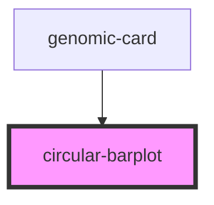

# circular-barplot

<!-- Auto Generated Below -->

## Properties

| Property                     | Attribute         | Description | Type                                   | Default     |
| ---------------------------- | ----------------- | ----------- | -------------------------------------- | ----------- |
| `active_rotation`            | `active_rotation` |             | `any`                                  | `undefined` |
| `gene_coordinates`           | --                |             | `Coordinate[]`                         | `undefined` |
| `genome_size`                | `genome_size`     |             | `number`                               | `undefined` |
| `list_coordinates`           | --                |             | `number[]`                             | `undefined` |
| `onClickBarplot`             | --                |             | `(start: number, end: number) => void` | `undefined` |
| `selected_sgrna_coordinates` | --                |             | `string[]`                             | `undefined` |

## Dependencies

### Used by

 - [genomic-card](../genomic-card)

### Graph

----------------------------------------------

*Built with [StencilJS](https://stenciljs.com/)*
