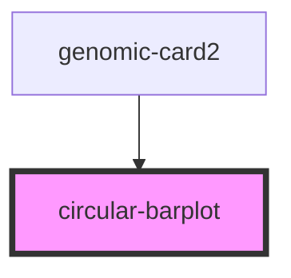

# circular-barplot

<!-- Auto Generated Below -->

## Properties

| Property           | Attribute     | Description | Type       | Default     |
| ------------------ | ------------- | ----------- | ---------- | ----------- |
| `genome_size`      | `genome_size` |             | `number`   | `undefined` |
| `list_coordinates` | --            |             | `number[]` | `undefined` |

## Dependencies

### Used by

 - [genomic-card2](../genomic-card2)

### Graph

----------------------------------------------

*Built with [StencilJS](https://stenciljs.com/)*
