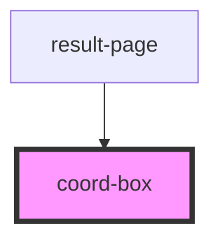

# coord-box

<!-- Auto Generated Below -->

## Properties

| Property         | Attribute        | Description | Type               | Default     |
| ---------------- | ---------------- | ----------- | ------------------ | ----------- |
| `current_genes`  | `current_genes`  |             | `any`              | `undefined` |
| `current_sgrnas` | `current_sgrnas` |             | `any`              | `undefined` |
| `selected`       | --               |             | `CurrentSelection` | `undefined` |

## Events

| Event                       | Description | Type               |
| --------------------------- | ----------- | ------------------ |
| `coord-box.coordinate-out`  |             | `CustomEvent<any>` |
| `coord-box.coordinate-over` |             | `CustomEvent<any>` |

## Dependencies

### Used by

 - [result-page](../result-page)

### Graph

----------------------------------------------

*Built with [StencilJS](https://stenciljs.com/)*
