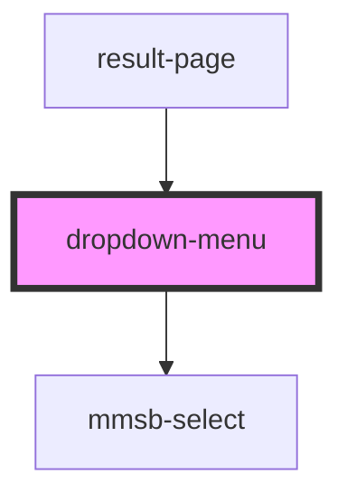

# dropdown-menu

<!-- Auto Generated Below -->

## Properties

| Property      | Attribute | Description | Type                      | Default     |
| ------------- | --------- | ----------- | ------------------------- | ----------- |
| `fasta_refs`  | --        |             | `string[]`                | `[]`        |
| `organisms`   | --        |             | `string[]`                | `[]`        |
| `selectOrg`   | --        |             | `(org: string) => void`   | `undefined` |
| `selectRef`   | --        |             | `(ref: string) => void`   | `undefined` |
| `selectSgrna` | --        |             | `(sgrna: string) => void` | `undefined` |
| `selected`    | --        |             | `CurrentSelection`        | `undefined` |
| `sgrnas`      | --        |             | `SGRNAForOneEntry[]`      | `[]`        |

## Events

| Event                                | Description | Type               |
| ------------------------------------ | ----------- | ------------------ |
| `dropdown-menu.display-button-click` |             | `CustomEvent<any>` |

## Dependencies

### Used by

 - [result-page](../result-page)

### Depends on

- mmsb-select

### Graph

----------------------------------------------

*Built with [StencilJS](https://stenciljs.com/)*
