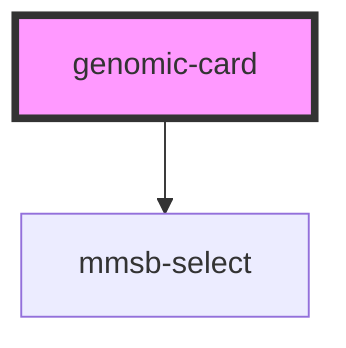

# genomic-card

<!-- Auto Generated Below -->

## Properties

| Property           | Attribute          | Description | Type                                        | Default     |
| ------------------ | ------------------ | ----------- | ------------------------------------------- | ----------- |
| `all_data`         | `all_data`         |             | `string`                                    | `undefined` |
| `diagonal_svg`     | `diagonal_svg`     |             | `number`                                    | `undefined` |
| `gene`             | `gene`             |             | `string`                                    | `undefined` |
| `onOrganismChange` | --                 |             | `(organism: string, sgrna: string) => void` | `undefined` |
| `orgSelected`      | `org-selected`     |             | `string`                                    | `undefined` |
| `org_names`        | `org_names`        |             | `string`                                    | `undefined` |
| `selectedSection`  | `selected-section` |             | `number`                                    | `-1`        |
| `sgrnaSelected`    | `sgrna-selected`   |             | `string`                                    | `undefined` |
| `size`             | `size`             |             | `string`                                    | `undefined` |
| `sizeSelected`     | `size-selected`    |             | `number`                                    | `undefined` |
| `subSgrna`         | --                 |             | `string[]`                                  | `undefined` |

## Events

| Event           | Description | Type               |
| --------------- | ----------- | ------------------ |
| `changeRefCard` |             | `CustomEvent<any>` |
| `sgDataSection` |             | `CustomEvent<any>` |

## Dependencies

### Depends on

- mmsb-select

### Graph

----------------------------------------------

*Built with [StencilJS](https://stenciljs.com/)*
