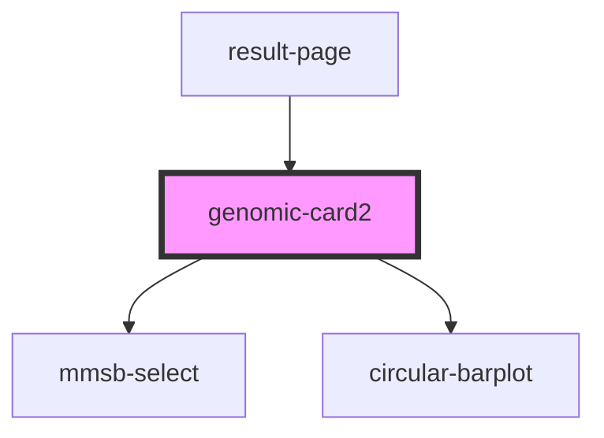

# genomic-card2

<!-- Auto Generated Below -->

## Properties

| Property             | Attribute      | Description | Type                               | Default     |
| -------------------- | -------------- | ----------- | ---------------------------------- | ----------- |
| `changeOrganism`     | --             |             | `(org: string) => void`            | `undefined` |
| `changeRef`          | --             |             | `(ref: string) => void`            | `undefined` |
| `changeSgrna`        | --             |             | `(sgrna: string) => void`          | `undefined` |
| `changeSgrnaSubset`  | --             |             | `(sgrna_subset: string[]) => void` | `undefined` |
| `current_references` | --             |             | `string[]`                         | `undefined` |
| `current_sgrnas`     | --             |             | `SGRNAForOneEntry[]`               | `undefined` |
| `diagonal_svg`       | `diagonal_svg` |             | `number`                           | `undefined` |
| `hidden_references`  | --             |             | `string[]`                         | `undefined` |
| `initial_sgrnas`     | --             |             | `SGRNAForOneEntry[]`               | `undefined` |
| `onClickHighlight`   | --             |             | `() => void`                       | `undefined` |
| `organisms`          | --             |             | `string[]`                         | `undefined` |
| `selected`           | --             |             | `CurrentSelection`                 | `undefined` |

## Events

| Event                          | Description | Type               |
| ------------------------------ | ----------- | ------------------ |
| `genomic-card.button-click`    |             | `CustomEvent<any>` |
| `genomic-card.coordinate-out`  |             | `CustomEvent<any>` |
| `genomic-card.coordinate-over` |             | `CustomEvent<any>` |

## Dependencies

### Used by

 - [result-page](../result-page)

### Depends on

- mmsb-select
- [circular-barplot](../circular-barplot)

### Graph

----------------------------------------------

*Built with [StencilJS](https://stenciljs.com/)*
