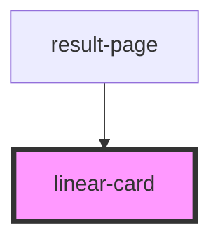

# linear-card

<!-- Auto Generated Below -->

## Properties

| Property    | Attribute   | Description | Type         | Default     |
| ----------- | ----------- | ----------- | ------------ | ----------- |
| `all_sgrna` | `all_sgrna` |             | `string`     | `undefined` |
| `gene`      | `gene`      |             | `string`     | `undefined` |
| `nb_step`   | `nb_step`   |             | `string`     | `"20"`      |
| `onClose`   | --          |             | `() => void` | `undefined` |
| `width_bar` | `width_bar` |             | `string`     | `"90%"`     |
| `width_div` | `width_div` |             | `string`     | `undefined` |

## Dependencies

### Used by

 - [result-page](../result-page)

### Graph

----------------------------------------------

*Built with [StencilJS](https://stenciljs.com/)*
