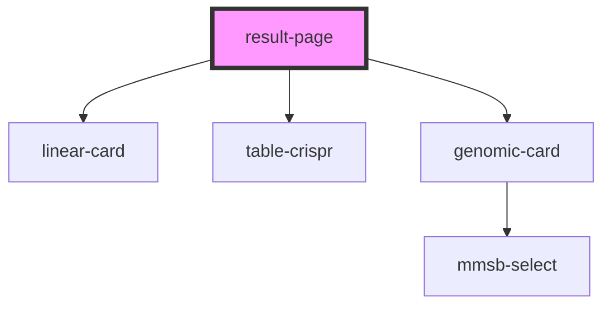

# table-crispr

<!-- Auto Generated Below -->

## Properties

| Property        | Attribute       | Description | Type     | Default     |
| --------------- | --------------- | ----------- | -------- | ----------- |
| `all_data`      | `all_data`      |             | `string` | `undefined` |
| `all_data_json` | --              |             | `{}`     | `undefined` |
| `complete_data` | `complete_data` |             | `string` | `undefined` |
| `currentGenes`  | `current-genes` |             | `string` | `undefined` |
| `currentSgrna`  | `current-sgrna` |             | `string` | `undefined` |
| `gene`          | `gene`          |             | `string` | `undefined` |
| `gene_json`     | --              |             | `{}`     | `undefined` |
| `orgSelected`   | `org-selected`  |             | `string` | `undefined` |
| `org_names`     | `org_names`     |             | `string` | `undefined` |
| `refSelected`   | `ref-selected`  |             | `string` | `undefined` |
| `size`          | `size`          |             | `string` | `undefined` |

## Dependencies

### Depends on

- linear-card
- table-crispr
- genomic-card

### Graph

----------------------------------------------

*Built with [StencilJS](https://stenciljs.com/)*
