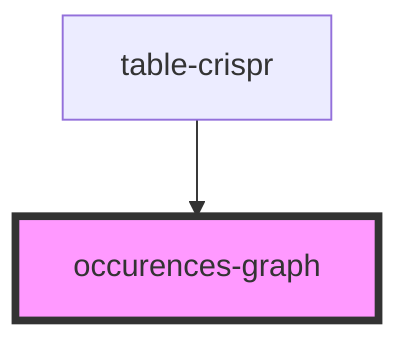

# occurences-graph

<!-- Auto Generated Below -->

## Properties

| Property          | Attribute | Description | Type                                        | Default     |
| ----------------- | --------- | ----------- | ------------------------------------------- | ----------- |
| `occurences_data` | --        |             | `{ name: string; coords_count: number; }[]` | `undefined` |

## Dependencies

### Used by

 - [table-crispr](../table-crispr)

### Graph

----------------------------------------------

*Built with [StencilJS](https://stenciljs.com/)*
