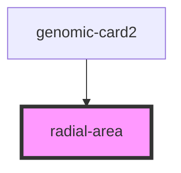

# radial-area

<!-- Auto Generated Below -->

## Properties

| Property       | Attribute      | Description | Type                 | Default     |
| -------------- | -------------- | ----------- | -------------------- | ----------- |
| `genome_size`  | `genome_size`  |             | `number`             | `undefined` |
| `sgrna_length` | `sgrna_length` |             | `number`             | `23`        |
| `sgrnas`       | --             |             | `SGRNAForOneEntry[]` | `undefined` |

## Dependencies

### Used by

 - [genomic-card2](../genomic-card2)

### Graph

----------------------------------------------

*Built with [StencilJS](https://stenciljs.com/)*
