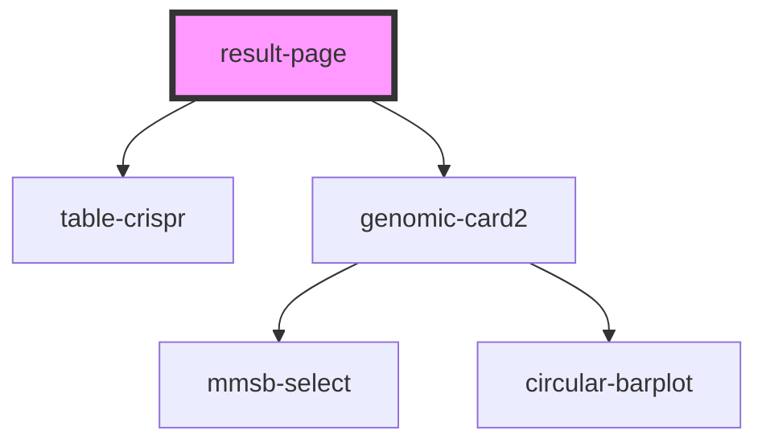

# table-crispr

<!-- Auto Generated Below -->

## Properties

| Property         | Attribute        | Description | Type     | Default     |
| ---------------- | ---------------- | ----------- | -------- | ----------- |
| `all_data`       | `all_data`       |             | `string` | `undefined` |
| `complete_data`  | `complete_data`  |             | `string` | `undefined` |
| `fasta_metadata` | `fasta_metadata` |             | `string` | `undefined` |
| `gene`           | `gene`           |             | `string` | `undefined` |
| `org_names`      | `org_names`      |             | `string` | `undefined` |
| `size`           | `size`           |             | `string` | `undefined` |

## Dependencies

### Depends on

- [table-crispr](../table-crispr)
- [genomic-card2](../genomic-card2)

### Graph

----------------------------------------------

*Built with [StencilJS](https://stenciljs.com/)*
