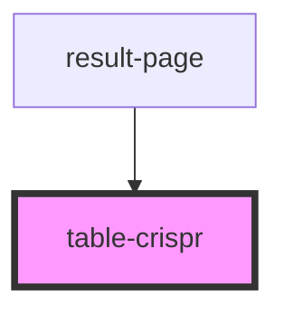

# table-crispr

<!-- Auto Generated Below -->

## Properties

| Property          | Attribute          | Description | Type                                           | Default     |
| ----------------- | ------------------ | ----------- | ---------------------------------------------- | ----------- |
| `cardAction`      | --                 |             | `(click_target: any, sgrna: string[]) => void` | `undefined` |
| `cardAllAction`   | --                 |             | `() => void`                                   | `undefined` |
| `card_selection`  | --                 |             | `string[]`                                     | `undefined` |
| `complete_data`   | --                 |             | `SequenceSGRNAHit[]`                           | `undefined` |
| `gene`            | `gene`             |             | `boolean`                                      | `undefined` |
| `onOrganismClick` | --                 |             | `(organism: string, sgrna: string) => void`    | `undefined` |
| `reinitSelection` | --                 |             | `() => void`                                   | `undefined` |
| `selected`        | --                 |             | `CurrentSelection`                             | `undefined` |
| `shouldHighlight` | `should-highlight` |             | `boolean`                                      | `undefined` |

## Dependencies

### Used by

 - [result-page](../result-page)

### Graph

----------------------------------------------

*Built with [StencilJS](https://stenciljs.com/)*
