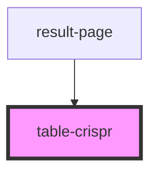

# table-crispr

<!-- Auto Generated Below -->

## Properties

| Property          | Attribute          | Description | Type                                        | Default     |
| ----------------- | ------------------ | ----------- | ------------------------------------------- | ----------- |
| `complete_data`   | --                 |             | `SequenceSGRNAHit[]`                        | `undefined` |
| `onOrganismClick` | --                 |             | `(organism: string, sgrna: string) => void` | `undefined` |
| `selected`        | --                 |             | `CurrentSelection`                          | `undefined` |
| `shouldHighlight` | `should-highlight` |             | `boolean`                                   | `undefined` |

## Events

| Event                    | Description | Type               |
| ------------------------ | ----------- | ------------------ |
| `table-crispr.org-click` |             | `CustomEvent<any>` |

## Dependencies

### Used by

 - [result-page](../result-page)

### Graph

----------------------------------------------

*Built with [StencilJS](https://stenciljs.com/)*
